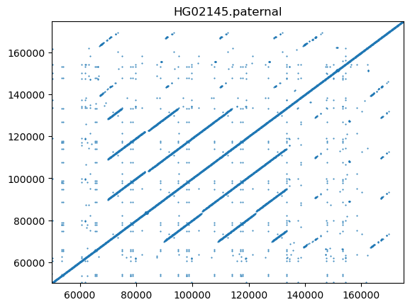

# Method for pangenome analysis LAIR and LILR gene family haplotype analysis and annotation 

With the recently released human pangenome sequences, we are interested in analyzing the LAIR/LILR region using the assembly. Our goal is to annotate the LAIR/LILR genes on top of the assembled contigs and extract the genomic sequences corresponding to each gene. This will provide a foundation for typing LAIR/LILR sequences.

## The genomic region and the genes under consideration 

We consider the 570kb region from GRCh38: chr19:54150000-54720000 as the LAIR/LILR region. In this region, there are 13 LAIR/LILR genes (LILRB3, LILRA6, LILRB5, LILRB2, LILRA3, LILRA5, LILRA4, LAIR1, TTYH1, LENG8, LENG9, CDC42EP5, LAIR2, LILRA2, LILRA1, LILRB1, LILRB4) that we are interested in. We use PGR-TK to fetch the contigs that correspond to the 570kb region in GRCh38. With the fetched sequences, we filter out hits less than 20kb. In the 47 samples from the HPRC years release, 37 haplotypes are assembled as a single contig through the region, 50 haplotypes are split into two contigs, 5 haplotypes are covered by 3 contigs, and 2 haplotypes are covered by 4 contigs.


```bash
## fetch LAIR/LILR sequences
cat << EOF  | tr " " "\t" > regions_interest
LAIR hg38_tagged.fa chr19_hg38 54150000 54720000
LAIR_sub_1 hg38_tagged.fa chr19_hg38 54618706 54672913
LILRB1 hg38_tagged.fa chr19_hg38 54601705 54654041
EOF
mkdir -p results
\time -v pgr-fetch-seqs /wd/pgr-tk-demo-data/data/pgr-tk-HGRP-y1-evaluation-set-v0 \
    -r ./regions_interest > ./results/ROI_seq.fa
\time -v pgr-query /wd/pgr-tk-demo-data/data/pgr-tk-HGRP-y1-evaluation-set-v0 \
    ./results/ROI_seq.fa ./results/pg_seqs --merge-range-tol 100000
python filter.py > LAIR_HPRC.fa
```

```python
## filter.py
import pgrtk

sdb = pgrtk.SeqIndexDB()
sdb.load_from_fastx("./results/pg_seqs.000.fa", 80, 33, 1, 8)
sinfo = sdb.seq_info.copy()

for sid in sinfo:
    ctg, _1, seq_len = sinfo[sid]
    if seq_len < 20000:
        continue
    seq = sdb.get_seq_by_id(sid)
    print(f">{ctg}")
    print(pgrtk.u8_to_string(seq))
```

Here is an example of the self-self dot-plot of the paternal haplotype sample HG02145. A quasi-palindromic similarity and a copy number variation hotspot near LILRA6 are visible.




## Annotate the haplotypes with miniprot and a set of bait protein sequence 

Since the diversity of the region has not been thoroughly studied with the pangenome dataset before, we decided to first use a set of 'bait' protein sequences to identify the regions of the haplotype sequence collection that correspond to these 'bait' sequences. For each gene, we fetch a known protein sequence from GenBank and align it with the DNA sequence to identify the genes on each haplotype.

Here is the list of GenBank accession numbers of the protein sequences that we used in the study.

```
LILRB4: NP_001265355.2 leukocyte immunoglobulin-like receptor subfamily B member 4 isoform 1 precursor [Homo sapiens]
LILRB1: NP_001075106.2 leukocyte immunoglobulin-like receptor subfamily B member 1 isoform 2 precursor [Homo sapiens]
LILRA1: NP_006854.1 leukocyte immunoglobulin-like receptor subfamily A member 1 isoform 1 precursor [Homo sapiens]
LAIR1: NP_002278.2 leukocyte-associated immunoglobulin-like receptor 1 isoform a precursor [Homo sapiens]
LAIR2: NP_002279.2 leukocyte-associated immunoglobulin-like receptor 2 isoform a precursor [Homo sapiens]
LILRA4: leukocyte immunoglobulin-like receptor subfamily A member 4 precursor [Homo sapiens]
LILRA5: NP_067073.1 leukocyte immunoglobulin-like receptor subfamily A member 5 isoform 1 precursor [Homo sapiens]
LILRB2: NP_001074447.2 leukocyte immunoglobulin-like receptor subfamily B member 2 isoform 2 precursor [Homo sapiens]
LILRB5: NP_001074911.2 leukocyte immunoglobulin-like receptor subfamily B member 5 isoform 1 precursor [Homo sapiens]
LILRA6: NP_077294.3 leukocyte immunoglobulin-like receptor subfamily A member 6 isoform 1 precursor [Homo sapiens]
LILRB3: NP_006855.3 leukocyte immunoglobulin-like receptor subfamily B member 3 isoform 2 precursor [Homo sapiens]
LILRA3: NP_001166125.1 [organism=Homo sapiens] [GeneID=11026] [isoform=2 precursor]
TTYH1: NP_001005367.1 protein tweety homolog 1 isoform 2 [Homo sapiens]
LENG8: NP_001362567.1 leukocyte receptor cluster member 8 isoform 1 [Homo sapiens]
LENG9: XP_045037336.1 leukocyte receptor cluster member 9 isoform X1 [Homo sapiens]
CDC42EP5: NP_659494.2 cdc42 effector protein 5 [Homo sapiens]
LILRA2: NP_001277200.1 leukocyte immunoglobulin-like receptor subfamily A member 2 isoform d precursor [Homo sapiens]
```

We notice that some of the protein sequences are highly similar to each other. 


Due to the similarity, our earlier attempt to use Miniprot to align the protein sequences to the DNA sequences resulted in some confusion, as the aligner may use similar exons from different genes. We resolved this by specifying the limit of the largest intron sizes. Here is the alignment command we used:

```bash
miniprot results/target_seq.fa LAIR_protein_ref.fa -j 2 --trans --aln --max-intron-out 20000 -G 20000 --outs=0.975 --outc=0.8 --gff
```
In the example, the `target_seq.fa` should contain all contigs corresponding to one haplotype.

The Miniprot may output multiple hits and ranks them for each query protein sequence. We use the top hit for the following analysis. (The analysis using all hits is also available.)

We use the output from Miniprot to obtain the DNA, CDS, and protein sequences corresponding to the query sequences. (Refer to `annotate_proteins.py` for detailed steps on processing.)

We gather the DNA, CDS, and protein sequences for each gene of interest from all haplotypes. These sequences will be utilized for building a typing sequence database after a simple de-deduplication process. Additionally, we generate consensus sequences for each of the haplotypes using the `pgrtk.naive_dbg_consensus()` function in the PGR-TK library (see `get_DNA_consensus.py` and `get_CDS_consensus.py` for details).

## Sequence similarity of the DNA and CDS consensus

Dot plots for DNA sequences of the 13 LILR/LIAR genes (DNA sequences):


Dot plots for DNA sequences of the 13 LILR/LIAR genes (CDS):


## Visualize the annotation with pangenome principal bundle view

For the haplotype contigs, the identified genes, and the corresponding CDS, we generate principal bundles to compare the different haplotypes on different scales. This serves several purposes: (1) it reveals the different haplotype structures in the samples, and (2) identifies potential issues from the alignments and annotation processes. We also use the "muscle" program to generate multiple sequence alignments of the identified tentative protein sequences to check for variations at the protein level.

We integrate the visualization results into a simple web interface so we can examine all of them more efficiently.


## A number preliminary observations (of some anomalies)

We found that a number of LILRA3 genes are annotated as overlapping with LILRA1. This seems to be associated with a structural variation at the typical LILRA3 locus (e.g., HG00673.paternal, NA20129.maternal, and hg38). There might be alternative forms of LILRA3 that deviate from our bait protein sequence of LILRA3.


For LILRA5, the identified sequences do not start with the start codon "ATG/M". Instead, all sequences starts with "CAG/Q". See the example below:
```
LILRA5 HG002.maternal.f1_assembly_v2_genbank::HG002#2#JAHKSD>
CAGGCACCATGGTCTCATCCATCTGCACAGCTGCAGCCAGTGGGAGGAGACGCCGTGAGCCCTGCCCTCATGGTTCTGCTCTGCCTCGgtgag>
Q..A..P..W..S..H..P..S..A..Q..L..Q..P..V..G..G..D..A..V..S..P..A..L..M..V..L..L..C..L..G     >
   |  |  |  |  |  |  |  |  |  |  |  |  |  |  |  |  |  |  |  |  |  |  |  |  |  |  |  |  |     >
M  A  P  W  S  H  P  S  A  Q  L  Q  P  V  G  G  D  A  V  S  P  A  L  M  V  L  L  C  L  G     >
```


## Command line "workflow" 

The follow `justfile` (~ `Makefile`) is useful for reproducing the results:

```makefile
fetch_seqs:
    cat << EOF  | tr " " "\t" > regions_interest
    LAIR hg38_tagged.fa chr19_hg38 54150000 54730000
    EOF
    mkdir -p results
    \time -v pgr-fetch-seqs /wd/pgr-tk-demo-data/data/pgr-tk-HGRP-y1-evaluation-set-v0 \
        -r ./regions_interest > ./results/ROI_seq.fa
    \time -v pgr-query /wd/pgr-tk-demo-data/data/pgr-tk-HGRP-y1-evaluation-set-v0 \
        ./results/ROI_seq.fa ./results/pg_seqs --merge-range-tol 100000
    python filter.py > LAIR_HPRC.fa

annotate_protein:
    python annotate_proteins.py

LAIR_plot:
    pgr-pbundle-decomp LAIR_HPRC.fa -w 80 -r 8 --min-span 32 --bundle-length-cutoff 1000 --min-branch-size 4 --min-cov 0 LAIR_HPRC

    pgr-pbundle-bed2dist LAIR_HPRC.bed LAIR_HPRC. -l

    pgr-pbundle-bed2svg LAIR_HPRC.bed LAIR_HPRC_rank1. --html --ddg-file LAIR_HPRC.ddg --offsets LAIR_HPRC.offset --track-panel-width 800 --track-range 650000 --annotation-region-bedfile results/all_annotation_rank1.bed --annotation-region-stroke-width 8

    pgr-pbundle-bed2svg LAIR_HPRC.bed LAIR_HPRC. --html --ddg-file LAIR_HPRC.ddg --offsets LAIR_HPRC.offset --track-panel-width 800 --track-range 650000 --annotation-region-bedfile results/all_annotation.bed --annotation-region-stroke-width 8

LAIR_gene_plot:
    python get_region_analysis.py
    python get_gene_analysis.py
    python get_gene_analysis_sparse.py
    python get_CDS_analysis.py
    python get_PROT_analysis.py

get_consensus:
    python get_CDS_consensus.py
    python get_DNA_consensus.py

all: annotate_protein LAIR_plot LAIR_gene_plot get_consensus
```

## List of python scripts

annotate_proteins.py:
```python
import pgrtk
import os

sdb = pgrtk.SeqIndexDB()
sdb.load_from_fastx("./LAIR_HPRC.fa")
sinfo = sdb.seq_info.copy()

out_bed_file = open("results/all_annotation.bed", "w")
out_bed_file_rank1 = open("results/all_annotation_rank1.bed", "w")
out_seq_files = {}
out_seq_files_rank1 = {}
out_cds_files = {}
out_cds_files_rank1 = {}
out_prot_files = {}
out_prot_files_rank1 = {}

haplotype_to_seq = {}
for sid in sinfo:
    ctg, _1, seq_len = sinfo[sid]
    key = "_".join(ctg.split(".")[:2])
    seq = sdb.get_seq_by_id(sid)
    haplotype_to_seq.setdefault(key, [])
    haplotype_to_seq[key].append( (ctg, seq) )


for key in haplotype_to_seq:
    with open(f"results/target_seq_{key}.fa","w") as f:
        for ctg, seq in haplotype_to_seq[key]:
            print(f">{ctg}", file=f)
            print(pgrtk.u8_to_string(seq), file=f)
    os.system(f"""./miniprot results/target_seq_{key}.fa LAIR_protein_ref.fa -j 2 --trans --aln --max-intron-out 20000 -G 20000 --outs=0.975 --outc=0.8 --gff > results/LAIR_HPRC_annotation_{key}.gff""")
    with open(f"results/LAIR_HPRC_annotation_{key}.gff") as f:
        for r in f:
            r = r.strip().split("\t")
            if r[0] == "##ATN":
                ATN = r[1]
                seq = ATN.upper()
                seq = seq.replace("-", "")
                continue

            if r[0] == "##PAF":
                ctg = r[6]
                continue

            if r[0] == "##STA":
                STA = r[1]
                continue

            if len(r) < 3:
                continue

            if r[2] == "mRNA":
                ATN = ATN.replace("a","").replace("t","").replace("g","").replace("c","").replace("-","")
                bgn, end = int(r[3]), int(r[4])
                strand = r[6]
                """ID=MP000007;Rank=2;Identity=0.6973;Positive=0.8016;Frameshift=2;StopCodon=1;Target=LILRA4"""
                annotation_dict = dict([_.split("=") for _ in r[8].split(" ")[0].split(";")])
                target = annotation_dict["Target"]
                rank = int(annotation_dict["Rank"])
                if rank == 1 and "Frameshift" not in annotation_dict:
                    print(r[0], r[3], r[4], target, "#000", r[8], file=out_bed_file_rank1, sep="\t") 
                    if target not in out_seq_files_rank1:
                        out_seq_files_rank1.setdefault(target, open(f"results/genes/{target}_DNA_rank1.fa", "w"))
                        out_cds_files_rank1.setdefault(target, open(f"results/genes/{target}_CDS_rank1.fa", "w"))
                        out_prot_files_rank1.setdefault(target, open(f"results/genes/{target}_PROT_rank1.fa", "w"))
                    out_seq_file_rank1 = out_seq_files_rank1[target]
                    DNA_seq = seq
                    print(">{}:{}-{} {}".format(ctg, r[3], r[4], r[8]), file=out_seq_file_rank1)
                    print(DNA_seq, file=out_seq_file_rank1)

                    out_cds_file_rank1 = out_cds_files_rank1[target]
                    print(">{}:{}-{} {}".format(ctg, r[3], r[4], r[8]), file=out_cds_file_rank1)
                    print(ATN, file=out_cds_file_rank1)

                    out_prot_file_rank1 = out_prot_files_rank1[target]
                    print(">{}:{}-{} {}".format(ctg, r[3], r[4], r[8]), file=out_prot_file_rank1)
                    print(STA, file=out_prot_file_rank1)

                print(r[0], r[3], r[4], target, "#000", r[8], file=out_bed_file, sep="\t") 
                if target not in out_seq_files:
                    out_seq_files.setdefault(target, open(f"results/genes/{target}_DNA.fa", "w"))
                    out_cds_files.setdefault(target, open(f"results/genes/{target}_CDS.fa", "w"))
                    out_prot_files.setdefault(target, open(f"results/genes/{target}_PROT.fa", "w"))
                out_seq_file = out_seq_files[target]
                DNA_seq = seq
                print(">{}:{}-{} {}".format(ctg, r[3], r[4], r[8]), file=out_seq_file)
                print(DNA_seq, file=out_seq_file)

                out_cds_file = out_cds_files[target]
                print(">{}:{}-{} {}".format(ctg, r[3], r[4], r[8]), file=out_cds_file)
                print(ATN, file=out_cds_file)

                out_prot_file = out_prot_files[target]
                print(">{}:{}-{} {}".format(ctg, r[3], r[4], r[8]), file=out_prot_file)
                print(STA, file=out_prot_file)

out_bed_file.close()
out_bed_file_rank1.close()
[f.close() for f in out_seq_files.values()]
[f.close() for f in out_seq_files_rank1.values()]
[f.close() for f in out_cds_files.values()]
[f.close() for f in out_cds_files_rank1.values()]
```


get_region_analysis.py:

```python
import os
import pgrtk

gene_names = "LILRA2 CDC42EP5 LAIR1 LAIR2 LENG8 LENG9 LILRB4 LILRA1 LILRA3 LILRA4 LILRA5 LILRA6 LILRB1 LILRB2 LILRB3 LILRB5 TTYH1".split()

annotation = []
with open("results/all_annotation.bed") as f:
    for r in f:
        r = r.strip().split("\t")
        annotation.append(r)

for gene_name in gene_names:
    
    f = open(f"results/annotation_{gene_name}.bed", "w")
    for r in annotation:
        if r[3] == gene_name:
            print("\t".join(r), file=f)
    f.close() 

    os.system(f"""
        pgr-pbundle-bed2svg LAIR_HPRC.bed results/genes/{gene_name}_region. --html --ddg-file LAIR_HPRC.ddg --offsets LAIR_HPRC.offset --track-panel-width 800 --track-range 650000 --annotation-region-bedfile results/annotation_{gene_name}.bed --annotation-region-stroke-width 8
    """)
```

get_gene_analysis.py:
```python
import os
import pgrtk

gene_names = "LILRA2 CDC42EP5 LAIR1 LAIR2 LENG8 LENG9 LILRB4 LILRA1 LILRA3 LILRA4 LILRA5 LILRA6 LILRB1 LILRB2 LILRB3 LILRB5 TTYH1".split()
for gene_name in gene_names:
    sdb = pgrtk.SeqIndexDB()
    sdb.load_from_fastx(f"results/genes/{gene_name}_DNA_rank1.fa")
    sinfo = sdb.seq_info.copy()
    lengths = []
    for sid in sinfo:
        ctg, _1, seq_len = sinfo[sid]
        lengths.append(seq_len)
    median_len = lengths[int(len(lengths)/2)] 
    target_len = int(median_len * 1.2);
    os.system(f"""
pgr-pbundle-decomp results/genes/{gene_name}_DNA_rank1.fa -w 80 -r 1 --min-span 12 --bundle-length-cutoff 10 --min-branch-size 0 --min-cov 0 results/genes/{gene_name}_DNA_rank1

pgr-pbundle-bed2dist results/genes/{gene_name}_DNA_rank1.bed results/genes/{gene_name}_DNA_rank1 -l

pgr-pbundle-bed2svg results/genes/{gene_name}_DNA_rank1.bed results/genes/{gene_name}_DNA_rank1. --html --ddg-file results/genes/{gene_name}_DNA_rank1.ddg --offsets results/genes/{gene_name}_DNA_rank1.offset --track-panel-width 800 --track-range {target_len} 
    """)

    sdb = pgrtk.SeqIndexDB()
    sdb.load_from_fastx(f"results/genes/{gene_name}_DNA.fa")
    sinfo = sdb.seq_info.copy()
    lengths = []
    for sid in sinfo:
        ctg, _1, seq_len = sinfo[sid]
        lengths.append(seq_len)
    median_len = lengths[int(len(lengths)/2)] 
    target_len = int(median_len * 1.2);
    os.system(f"""
pgr-pbundle-decomp results/genes/{gene_name}_DNA.fa -w 80 -r 1 --min-span 12 --bundle-length-cutoff 10 --min-branch-size 0 --min-cov 0 results/genes/{gene_name}_DNA

pgr-pbundle-bed2dist results/genes/{gene_name}_DNA.bed results/genes/{gene_name}_DNA -l

pgr-pbundle-bed2svg results/genes/{gene_name}_DNA.bed results/genes/{gene_name}_DNA. --html --ddg-file results/genes/{gene_name}_DNA.ddg --offsets results/genes/{gene_name}_DNA.offset --track-panel-width 800 --track-range {target_len} 
    """)
```

get_gene_analysis_sparse.py:
```python
import os
import pgrtk

gene_names = "LILRA2 CDC42EP5 LAIR1 LAIR2 LENG8 LENG9 LILRB4 LILRA1 LILRA3 LILRA4 LILRA5 LILRA6 LILRB1 LILRB2 LILRB3 LILRB5 TTYH1".split()
for gene_name in gene_names:
    sdb = pgrtk.SeqIndexDB()
    sdb.load_from_fastx(f"results/genes/{gene_name}_DNA_rank1.fa")
    sinfo = sdb.seq_info.copy()
    lengths = []
    for sid in sinfo:
        ctg, _1, seq_len = sinfo[sid]
        lengths.append(seq_len)
    median_len = lengths[int(len(lengths)/2)] 
    target_len = int(median_len * 1.2);
    os.system(f"""
pgr-pbundle-decomp results/genes/{gene_name}_DNA_rank1.fa -w 80 -r 3 --min-span 12 --bundle-length-cutoff 10 --min-branch-size 0 --min-cov 0 results/genes_sparse/{gene_name}_DNA_rank1

pgr-pbundle-bed2dist results/genes_sparse/{gene_name}_DNA_rank1.bed results/genes_sparse/{gene_name}_DNA_rank1 -l

pgr-pbundle-bed2svg results/genes_sparse/{gene_name}_DNA_rank1.bed results/genes_sparse/{gene_name}_DNA_rank1. --html --ddg-file results/genes_sparse/{gene_name}_DNA_rank1.ddg --offsets results/genes_sparse/{gene_name}_DNA_rank1.offset --track-panel-width 800 --track-range {target_len} 
    """)

    sdb = pgrtk.SeqIndexDB()
    sdb.load_from_fastx(f"results/genes/{gene_name}_DNA.fa")
    sinfo = sdb.seq_info.copy()
    lengths = []
    for sid in sinfo:
        ctg, _1, seq_len = sinfo[sid]
        lengths.append(seq_len)
    median_len = lengths[int(len(lengths)/2)] 
    target_len = int(median_len * 1.2);
    os.system(f"""
pgr-pbundle-decomp results/genes/{gene_name}_DNA.fa -w 80 -r 3 --min-span 12 --bundle-length-cutoff 10 --min-branch-size 0 --min-cov 0 results/genes_sparse/{gene_name}_DNA

pgr-pbundle-bed2dist results/genes_sparse/{gene_name}_DNA.bed results/genes_sparse/{gene_name}_DNA -l

pgr-pbundle-bed2svg results/genes_sparse/{gene_name}_DNA.bed results/genes_sparse/{gene_name}_DNA. --html --ddg-file results/genes_sparse/{gene_name}_DNA.ddg --offsets results/genes_sparse/{gene_name}_DNA.offset --track-panel-width 800 --track-range {target_len} 
    """)
```

get_CDS_analysis.py:

```
import os
import pgrtk

gene_names = "LILRA2 CDC42EP5 LAIR1 LAIR2 LENG8 LENG9 LILRB4 LILRA1 LILRA3 LILRA4 LILRA5 LILRA6 LILRB1 LILRB2 LILRB3 LILRB5 TTYH1".split()
for gene_name in gene_names:
    sdb = pgrtk.SeqIndexDB()
    sdb.load_from_fastx(f"results/genes/{gene_name}_CDS_rank1.fa")
    sinfo = sdb.seq_info.copy()
    lengths = []
    for sid in sinfo:
        ctg, _1, seq_len = sinfo[sid]
        lengths.append(seq_len)
    median_len = lengths[int(len(lengths)/2)] 
    target_len = int(median_len * 1.2);
    os.system(f"""
pgr-pbundle-decomp results/genes/{gene_name}_CDS_rank1.fa -w 32 -r 1 --min-span 8 --bundle-length-cutoff 0 --min-branch-size 0 --min-cov 0 results/genes/{gene_name}_CDS_rank1

pgr-pbundle-bed2dist results/genes/{gene_name}_CDS_rank1.bed results/genes/{gene_name}_CDS_rank1 -l

pgr-pbundle-bed2svg results/genes/{gene_name}_CDS_rank1.bed results/genes/{gene_name}_CDS_rank1. --html --ddg-file results/genes/{gene_name}_CDS_rank1.ddg --offsets results/genes/{gene_name}_CDS_rank1.offset --track-panel-width 800 --track-range {target_len} 
    """)

    sdb = pgrtk.SeqIndexDB()
    sdb.load_from_fastx(f"results/genes/{gene_name}_CDS.fa")
    sinfo = sdb.seq_info.copy()
    lengths = []
    for sid in sinfo:
        ctg, _1, seq_len = sinfo[sid]
        lengths.append(seq_len)
    median_len = lengths[int(len(lengths)/2)] 
    target_len = int(median_len * 1.2);
    os.system(f"""
pgr-pbundle-decomp results/genes/{gene_name}_CDS.fa -w 32 -r 1 --min-span 8 --bundle-length-cutoff 10 --min-branch-size 0 --min-cov 0 results/genes/{gene_name}_CDS

pgr-pbundle-bed2dist results/genes/{gene_name}_CDS.bed results/genes/{gene_name}_CDS -l

pgr-pbundle-bed2svg results/genes/{gene_name}_CDS.bed results/genes/{gene_name}_CDS. --html --ddg-file results/genes/{gene_name}_CDS.ddg --offsets results/genes/{gene_name}_CDS.offset --track-panel-width 800 --track-range {target_len} 
    """)
```

get_PROT_analysis.py:
```python
import os
import pgrtk

gene_names = "LILRA2 CDC42EP5 LAIR1 LAIR2 LENG8 LENG9 LILRB4 LILRA1 LILRA3 LILRA4 LILRA5 LILRA6 LILRB1 LILRB2 LILRB3 LILRB5 TTYH1".split()
for gene_name in gene_names:
    os.system(f"""
muscle -in results/genes/{gene_name}_PROT_rank1.fa -html -out results/genes/{gene_name}_PROT_rank1.html
    """)
    os.system(f"""
muscle -in results/genes/{gene_name}_PROT.fa -html -out results/genes/{gene_name}_PROT.html
    """)

```

get_CDS_consensus.py:
```python
import os
import pgrtk

gene_names = "LILRA2 CDC42EP5 LAIR1 LAIR2 LENG8 LENG9 LILRB4 LILRA1 LILRA3 LILRA4 LILRA5 LILRA6 LILRB1 LILRB2 LILRB3 LILRB5 TTYH1".split()


f = open("results/CDS_consensus.fa", "w")

for gene_name in gene_names:
    print(gene_name)

    sdb = pgrtk.SeqIndexDB()
    print(f"results/genes/{gene_name}_CDS.fa")
    sdb.load_from_fastx(f"results/genes/{gene_name}_CDS.fa")
    sinfo = sdb.seq_info.copy()
    seqs = []
    
    seq_lengths = []
    for sid in sinfo:
        _, _, slen = sinfo[sid]
        seq_lengths.append(slen)
        
    median = seq_lengths[int(len(seq_lengths)/2)]
    for sid in sinfo:
        seq = sdb.get_seq_by_id(sid)
        if abs(len(seq) - median) > median *0.05:
            continue
        seqs.append(seq)

    kmer_size = 23

    consensus=pgrtk.naive_dbg_consensus(seqs, kmer_size, 15)
    print(f">{gene_name}_CDS", file=f)
    print(pgrtk.u8_to_string(consensus), file=f)

    sdb = pgrtk.SeqIndexDB()
    sdb.load_from_fastx(f"results/genes/{gene_name}_CDS_rank1.fa")
    sinfo = sdb.seq_info.copy()
    seqs = []
    
    seq_lengths = []
    for sid in sinfo:
        _, _, slen = sinfo[sid]
        seq_lengths.append(slen)
        
    median = seq_lengths[int(len(seq_lengths)/2)]
    for sid in sinfo:
        seq = sdb.get_seq_by_id(sid)
        if abs(len(seq) - median) > median *0.05:
            continue
        seqs.append(seq)

    consensus=pgrtk.naive_dbg_consensus(seqs, kmer_size, 15)
    print(f">{gene_name}_CDS_rank1", file=f)
    print(pgrtk.u8_to_string(consensus), file=f)

f.close() 
```

get_DNA_consensus.py:
```python
import os
import pgrtk

gene_names = "LILRA2 CDC42EP5 LAIR1 LAIR2 LENG8 LENG9 LILRB4 LILRA1 LILRA3 LILRA4 LILRA5 LILRA6 LILRB1 LILRB2 LILRB3 LILRB5 TTYH1".split()


f = open("results/DNA_consensus.fa", "w")

for gene_name in gene_names:
    print(gene_name)

    sdb = pgrtk.SeqIndexDB()
    print(f"results/genes/{gene_name}_DNA.fa")
    sdb.load_from_fastx(f"results/genes/{gene_name}_DNA.fa")
    sinfo = sdb.seq_info.copy()
    seqs = []
    
    seq_lengths = []
    for sid in sinfo:
        _, _, slen = sinfo[sid]
        seq_lengths.append(slen)
        
    median = seq_lengths[int(len(seq_lengths)/2)]
    kmer_size = 83
    threshold = 0.05
    if gene_name == "LILRA3": # we need to figure what's wrong with LILRA3
        kmer_size = 451
        threshold = 0.10


    for sid in sinfo:
        seq = sdb.get_seq_by_id(sid)
        if abs(len(seq) - median) > median * threshold:
            continue
        seqs.append(seq)


    consensus=pgrtk.naive_dbg_consensus(seqs, kmer_size, 15)
    print(f">{gene_name}_DNA", file=f)
    print(pgrtk.u8_to_string(consensus), file=f)

    sdb = pgrtk.SeqIndexDB()
    sdb.load_from_fastx(f"results/genes/{gene_name}_DNA_rank1.fa")
    sinfo = sdb.seq_info.copy()
    seqs = []
    
    seq_lengths = []
    for sid in sinfo:
        _, _, slen = sinfo[sid]
        seq_lengths.append(slen)
        
    median = seq_lengths[int(len(seq_lengths)/2)]
    for sid in sinfo:
        seq = sdb.get_seq_by_id(sid)
        if abs(len(seq) - median) > median * threshold:
            continue
        seqs.append(seq)

    consensus=pgrtk.naive_dbg_consensus(seqs, kmer_size, 15)
    print(f">{gene_name}_DNA_rank1", file=f)
    print(pgrtk.u8_to_string(consensus), file=f)

f.close() 
```

## Rust web server code (use with Tron `https://github.com/cschin/tron`)

src/main.rs:

```rust
#![allow(dead_code)]
#![allow(unused_imports)]

use askama::Template;
use futures_util::Future;

use axum::{
    body::Body,
    extract::{Json, Path, State},
    http::{header, HeaderMap, HeaderName, HeaderValue, StatusCode},
    response::{Html, IntoResponse},
    routing::get,
    Router,
};
use serde::de::IntoDeserializer;
//use serde::{Deserialize, Serialize};
use tokio::sync::{mpsc::Sender, RwLock};

use serde_json::Value;

use tower_sessions::Session;
use tracing::debug;
use tron_app::{
    tron_components::{self, TnActionExecutionMethod, TnHtmlResponse, TnSelect},
    AppData,
};
use tron_components::{
    text::TnTextInput, TnButton, TnComponentBaseTrait, TnComponentState, TnComponentValue,
    TnContext, TnContextBase, TnEvent, TnEventActions, TnTextArea,
};
//use std::sync::Mutex;
use std::{collections::HashMap, env, fs, io::Read, pin::Pin, str::FromStr, sync::Arc};

// This is the main entry point of the application
// It sets up the application configuration and state
// and then starts the application by calling tron_app::run
#[tokio::main]
async fn main() {
    let api_routes = Router::<Arc<AppData>>::new()
    .route("/map_html/:gene/:feature", get(map_html))
    .route("/get_fasta_file/:gene/:feature",get(get_fasta_file));

    let app_config = tron_app::AppConfigure {
        address: [0, 0, 0, 0],
        log_level: Some("server=debug,tower_http=debug,tron_app=info"),
        http_only: true,
        api_router: Some(api_routes),
        cognito_login: false,
        ..Default::default()
    };
    // set app state
    let app_share_data = tron_app::AppData {
        context: RwLock::new(HashMap::default()),
        session_expiry: RwLock::new(HashMap::default()),
        event_actions: RwLock::new(TnEventActions::default()),
        build_context: Arc::new(Box::new(build_context)),
        build_actions: Arc::new(Box::new(build_actions)),
        build_layout: Arc::new(Box::new(layout)),
    };
    tron_app::run(app_share_data, app_config).await
}

// These functions are used to build the application context,
// layout, and event actions respectively
fn build_context() -> TnContext {
    let mut context = TnContextBase::default();

    let mut component_index = 0_u32;

    component_index += 1;
    let genes = ["LILRB3", "LILRA6", "LILRB5", 
    "LILRB2", "LILRA3", "LILRA5", 
    "LILRA4", "LAIR1", "TTYH1", 
    "LENG8", "LENG9", "CDC42EP5", 
    "LAIR2", "LILRA2", "LILRA1", 
    "LILRB1", "LILRB4"];

    let select_options = genes
        .into_iter()
        .map(|g| (g.to_string(), g.to_string()))
        .collect::<Vec<_>>();

    let mut select = TnSelect::<'static>::new(
        component_index,
        "select_gene".into(),
        "LAIR1".into(),
        select_options,
    );
    select.set_attribute("hx-target".to_string(), "#mapg_view_iframe".to_string());
    select.set_attribute("hx-swap".to_string(), "innerHTML".to_string());
    context.add_component(select);

    component_index += 1;
    let features = ["region", "DNA_rank1", "CDS_rank1", "PROT_rank1", "DNA", "CDS", "PROT"];

    let select_options = features
        .into_iter()
        .map(|g| (g.to_string(), g.to_string()))
        .collect::<Vec<_>>();

    let mut select = TnSelect::<'static>::new(
        component_index,
        "select_feature".into(),
        "DNA_rank1".into(),
        select_options,
    );
    select.set_attribute("hx-target".to_string(), "#mapg_view_iframe".to_string());
    select.set_attribute("hx-swap".to_string(), "innerHTML".to_string());
    context.add_component(select);

    component_index += 1;
    let mut update_btn = TnButton::new(component_index, "update_btn".into(), "Update".into());
    update_btn.set_attribute(
        "class".to_string(),
        "btn btn-sm btn-outline btn-primary w-full h-16 p-1".to_string(),
    );
    update_btn.set_attribute("hx-swap".to_string(), "innerHTML".to_string());

    update_btn.set_attribute("hx-target".to_string(), "#mapg_view_iframe".to_string());

    context.add_component(update_btn);

    component_index += 1;
    let mut download_html_btn = TnButton::new(
        component_index,
        "download_html_btn".into(),
        "Download HTML".into(),
    );
    download_html_btn.set_attribute(
        "class".to_string(),
        "btn btn-sm btn-outline btn-primary w-full h-16 p-1".to_string(),
    );
    let gene = "LAIR1".to_string();
    let feature = "DNA_rank1".to_string();
    download_html_btn.set_attribute("swap".to_string(), "none".to_string());
    download_html_btn.set_value(TnComponentValue::String(format!(r#"<a></a>Download HTML<a id="download_link" href="/api/map_html/{}/{}" download="{}_{}.html"></a>"#, gene, feature, gene, feature)));
    download_html_btn.set_attribute(
        "hx-on:click".into(),
        "document.getElementById('download_link').click()".into(),
    );
    context.add_component(download_html_btn);

    component_index += 1;
    let mut download_fasta_btn = TnButton::new(
        component_index,
        "download_fasta_btn".into(),
        "Download Sequences".into(),
    );
    download_fasta_btn.set_value(TnComponentValue::String(format!(r#"<a></a>Download Sequences<a id="download_fasta_link" href="/api/get_fasta_file/{}/{}" download="{}_{}.fa"></a>"#, gene, feature, gene, feature)));
    download_fasta_btn.set_attribute(
        "class".to_string(),
        "btn btn-sm btn-outline btn-primary w-full h-16 p-1".to_string(),
    );
    download_fasta_btn.set_attribute(
        "hx-on:click".into(),
        "document.getElementById('download_fasta_link').click()".into(),
    );
    download_fasta_btn.set_attribute("swap".to_string(), "none".to_string());
    context.add_component(download_fasta_btn);

    let context = Arc::new(RwLock::new(context));
    TnContext { base: context }
}

#[derive(Template)] // this will generate the code...
#[template(path = "app_page.html", escape = "none")] // using the template in this path, relative                                    // to the `templates` dir in the crate root
struct AppPageTemplate {
    select_gene: String,
    select_feature: String,
    update_btn: String,
    download_html_btn: String,
    download_fasta_btn: String,
}

fn layout(context: TnContext) -> String {
    let context_guard = context.blocking_read();
    let select_gene = context_guard.first_render_to_string("select_gene");
    let select_feature = context_guard.first_render_to_string("select_feature");
    let update_btn = context_guard.first_render_to_string("update_btn");
    let download_html_btn = context_guard.first_render_to_string("download_html_btn");
    let download_fasta_btn = context_guard.first_render_to_string("download_fasta_btn");

    let html = AppPageTemplate {
        select_feature,
        select_gene,
        update_btn,
        download_html_btn,
        download_fasta_btn,
    };
    html.render().unwrap()
}

fn build_actions(context: TnContext) -> TnEventActions {
    let mut actions = TnEventActions::default();

    let index = context.blocking_read().get_component_index("update_btn");
    actions.insert(
        index,
        (TnActionExecutionMethod::Await, Arc::new(updata_mapg)),
    );

    let index = context.blocking_read().get_component_index("select_gene");
    actions.insert(
        index,
        (TnActionExecutionMethod::Await, Arc::new(updata_mapg)),
    );

    let index = context.blocking_read().get_component_index("select_feature");
    actions.insert(
        index,
        (TnActionExecutionMethod::Await, Arc::new(updata_mapg)),
    );


    actions
}

fn updata_mapg(
    context: TnContext,
    _event: TnEvent,
    _payload: Value,
) -> Pin<Box<dyn Future<Output = TnHtmlResponse> + Send + Sync>> {
    let action = async move {
        let gene = context.get_value_from_component("select_gene").await;
        let gene = if let TnComponentValue::String(gene) = gene {
            gene
        } else {
            unreachable!()
        };
        let feature = context.get_value_from_component("select_feature").await;
        let feature = if let TnComponentValue::String(feature) = feature {
            feature
        } else {
            unreachable!()
        };
        tracing::info!(target:"tron_app", "gene:{} feature:{}", gene, feature);

        {
            let download_btn = context.get_component("download_html_btn").await;
            let mut download_btn = download_btn.write().await;
            download_btn.set_value(TnComponentValue::String(format!(r#"<a></a>Download HTML<a id="download_link" href="/api/map_html/{}/{}" download="{}_{}.html"></a>"#, gene, feature, gene, feature)));
        }
        context.set_ready_for("download_html_btn").await;

        {
            let download_fasta_btn = context.get_component("download_fasta_btn").await;
            let mut download_fasta_btn = download_fasta_btn.write().await;
            download_fasta_btn.set_value(TnComponentValue::String(format!(r#"<a></a>Download Sequences<a id="download_fasta_link" href="/api/get_fasta_file/{}/{}" download="{}_{}.fa"></a>"#, gene, feature, gene, feature)));
        }
        context.set_ready_for("download_fasta_btn").await;

        let header = HeaderMap::new();
        let html = format!(
            r#"<iframe class="w-full h-dvh" src="/api/map_html/{}/{}">"#,
            gene, feature
        );

        Some((header, Html::from(html.to_string())))
    };
    Box::pin(action)
}

async fn map_html(
    State(_app_data): State<Arc<AppData>>,
    session: Session,
    Path((gene, feature)): Path<(String, String)>,
) -> impl IntoResponse {
    let mut response_headers = HeaderMap::new();
    response_headers.insert(header::CONTENT_TYPE, "text/html".parse().unwrap());

    let _session_id = if let Some(session_id) = session.id() {
        session_id
    } else {
        return (StatusCode::FORBIDDEN, response_headers, Body::default());
    };

    let mut body = Vec::<u8>::new();
    let data_directory_path = env::var("MAPG_DATA_PATH")
        .unwrap_or_else(|e| panic!("{}: env variable MAPG_DATA_PATH not set!!", e));
    fs::File::open(format!(
        "{data_directory_path}/{gene}_{feature}.html"
    ))
    .unwrap()
    .read_to_end(&mut body)
    .unwrap_or_else(|e| {
        panic!(
            "{}: fail to read the MAPG HTML file: gene:{} feature:{}",
            e, gene, feature
        )
    });

    let body = Body::from(body);

    (StatusCode::OK, response_headers, body)
}


async fn get_fasta_file(
    State(_app_data): State<Arc<AppData>>,
    session: Session,
    Path((gene, feature)): Path<(String, String)>,
) -> impl IntoResponse {
    let mut response_headers = HeaderMap::new();
    response_headers.insert(header::CONTENT_TYPE, "text/plain".parse().unwrap());

    let _session_id = if let Some(session_id) = session.id() {
        session_id
    } else {
        return (StatusCode::FORBIDDEN, response_headers, Body::default());
    };

    let mut body = Vec::<u8>::new();
    let data_directory_path = env::var("MAPG_DATA_PATH")
        .unwrap_or_else(|e| panic!("{}: env variable MAPG_DATA_PATH not set!!", e));
    fs::File::open(format!(
        "{data_directory_path}/{gene}_{feature}.fa"
    ))
    .unwrap()
    .read_to_end(&mut body)
    .unwrap_or_else(|e| {
        panic!(
            "{}: fail to read the MAPG HTML file: gene:{} feature:{}",
            e, gene, feature
        )
    });

    let body = Body::from(body);

    (StatusCode::OK, response_headers, body)
}
```

Cargo.toml:
```toml
[package]
name = "lilr-explorer"
version = "0.1.0"
edition = "2021"

[dependencies]
axum = "0.7.5"
serde = { version = "1.0.197", features = ["derive"] }
tokio = { version = "1.37.0", features = ["full"] }
tracing = "0.1.40"
serde_json = "1.0.115"
futures-util = "0.3.30"
futures = "0.3.30"
tron_app = {git = "https://github.com/cschin/tron.git"}
#tron_app = {path = "../tron/tron_app"}
askama = "0.12.1"
bytes = "1.6.0"
flate2 = "1.0.30"
tower-sessions = "0.12.0"
once_cell = "1.19.0"
```

templates/app_page.html:
```html
<title> Pangenome Principal Bundle Viewer </title>

<div class="container flex mx-auto p-4 justify-center">
    <p class="flex-1 text-center mx-auto text-2xl p-2">LILR Pangenome Principal Bundle Viewer</p>
</div>
<hr class="py-2">
<div class="container mx-auto p-2">
    <div class="flex flex-row mx-auto w-full justify-items-center">
        <div class="flex flex-col basis-1/6">
        </div>
        <div class="flex flex-col basis-1/6">
            <div class="p-2">Select Gene</div>
            <div class="justify-items-stretch">
                {{select_gene}}
            </div>
        </div>
        <div class="flex flex-col basis-1/6">
            <div class="p-2">Select Feature</div>
            <div class="justify-items-stretch">
                {{select_feature}}
            </div>
        </div>
        <div class="flex flex-col basis-1/6 h-16">
            {{update_btn}}
        </div>
        <div class="flex flex-col basis-1/6 h-16">
            {{download_html_btn}}
        </div>

        <div class="flex flex-col basis-1/6 h-16">
            {{download_fasta_btn}}
        </div>
    </div>
</div>
<div class="container mx-auto p-2 h-min">
    <div id="mapg_view_iframe">
        <iframe>
    </div>
</div>
```

An example for running the web server:

```bash
# change direct to lilr-explorer source code directory
cd lilr-explorer
# point MAPG_DATA_PATH to a directory contains all html and fasta output  
export MAPG_DATA_PATH=$PREFIX/results/genes 
cargo run
```
